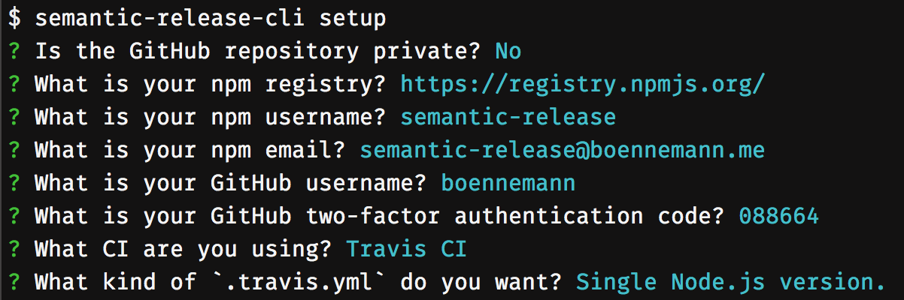

# Getting started

In order to use **semantic-release-plus** you must follow these steps:

1. [Install](./installation.md#installation) **semantic-release-plus** in your project
2. Configure your Continuous Integration service to [run **semantic-release-plus**](./ci-configuration.md#run-semantic-release-only-after-all-tests-succeeded)
3. Configure your Git repository and package manager repository [authentication](ci-configuration.md#authentication) in your Continuous Integration service
4. Configure **semantic-release-plus** [options and plugins](./configuration.md#configuration)

Alternatively those steps can be easily done with the [**semantic-release-plus** interactive CLI](https://github.com/semantic-release/cli):

```bash
cd your-module
npx semantic-release-cli setup
```



See the [semantic-release-cli](https://github.com/semantic-release/cli#what-it-does) documentation for more details.

**Note**: only a limited number of options, CI services and plugins are currently supported by `semantic-release-cli`.
